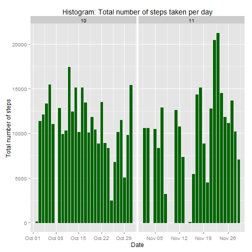
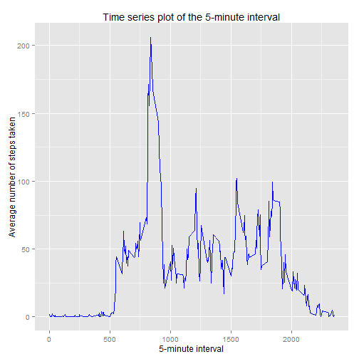
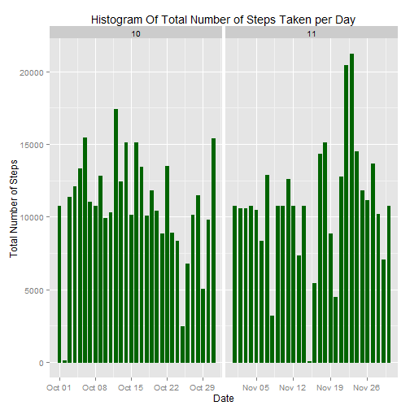
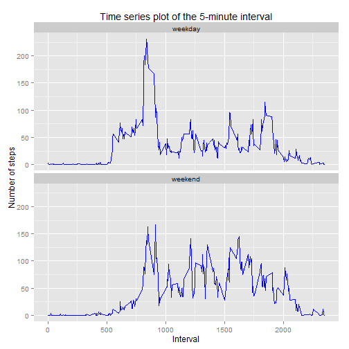

# Reproducible Research: Peer Assessment 1
February - 2015


## Loading and preprocessing the data

- Load the data (The file will be downloaded and unzipped only on its first execution)
- Process the data to remove NAs


```r
## only download if required
zipfile <- "repdata-data-activity.zip"
if(file.exists( zipfile ) == 0)
{
    fileUrl<- "https://d396qusza40orc.cloudfront.net/repdata%2Fdata%2Factivity.zip"
    download.file(fileUrl , destfile=zipfile , method="curl")
}

## only unzip if required
if(file.exists("activity.csv") == 0)
{
    print(" unzipping file ... ")
    unzip( zipfile )
}

## reading the data
mydata <- read.csv( "activity.csv"
                  , colClasses = c("integer", "Date", "factor") )

## checking original data frame
dim(mydata)
```

```
## [1] 17568     3
```

```r
summary(mydata)
```

```
##      steps             date               interval    
##  Min.   :  0.00   Min.   :2012-10-01   0      :   61  
##  1st Qu.:  0.00   1st Qu.:2012-10-16   10     :   61  
##  Median :  0.00   Median :2012-10-31   100    :   61  
##  Mean   : 37.38   Mean   :2012-10-31   1000   :   61  
##  3rd Qu.: 12.00   3rd Qu.:2012-11-15   1005   :   61  
##  Max.   :806.00   Max.   :2012-11-30   1010   :   61  
##  NA's   :2304                          (Other):17202
```

```r
str(mydata)
```

```
## 'data.frame':	17568 obs. of  3 variables:
##  $ steps   : int  NA NA NA NA NA NA NA NA NA NA ...
##  $ date    : Date, format: "2012-10-01" "2012-10-01" ...
##  $ interval: Factor w/ 288 levels "0","10","100",..: 1 226 2 73 136 195 198 209 212 223 ...
```

```r
head(mydata)
```

```
##   steps       date interval
## 1    NA 2012-10-01        0
## 2    NA 2012-10-01        5
## 3    NA 2012-10-01       10
## 4    NA 2012-10-01       15
## 5    NA 2012-10-01       20
## 6    NA 2012-10-01       25
```

```r
tail(mydata)
```

```
##       steps       date interval
## 17563    NA 2012-11-30     2330
## 17564    NA 2012-11-30     2335
## 17565    NA 2012-11-30     2340
## 17566    NA 2012-11-30     2345
## 17567    NA 2012-11-30     2350
## 17568    NA 2012-11-30     2355
```

```r
## count of rows with NAs per column
colSums( is.na( mydata ) )
```

```
##    steps     date interval 
##     2304        0        0
```

```r
# remove NAs
cleandata <- na.omit(mydata)
rownames(cleandata) <- NULL

# checking new data frame without missing values
dim(cleandata)
```

```
## [1] 15264     3
```

```r
summary(cleandata)
```

```
##      steps             date               interval    
##  Min.   :  0.00   Min.   :2012-10-02   0      :   53  
##  1st Qu.:  0.00   1st Qu.:2012-10-16   10     :   53  
##  Median :  0.00   Median :2012-10-29   100    :   53  
##  Mean   : 37.38   Mean   :2012-10-30   1000   :   53  
##  3rd Qu.: 12.00   3rd Qu.:2012-11-16   1005   :   53  
##  Max.   :806.00   Max.   :2012-11-29   1010   :   53  
##                                        (Other):14946
```

```r
str(cleandata)
```

```
## 'data.frame':	15264 obs. of  3 variables:
##  $ steps   : int  0 0 0 0 0 0 0 0 0 0 ...
##  $ date    : Date, format: "2012-10-02" "2012-10-02" ...
##  $ interval: Factor w/ 288 levels "0","10","100",..: 1 226 2 73 136 195 198 209 212 223 ...
##  - attr(*, "na.action")=Class 'omit'  Named int [1:2304] 1 2 3 4 5 6 7 8 9 10 ...
##   .. ..- attr(*, "names")= chr [1:2304] "1" "2" "3" "4" ...
```

```r
head(cleandata)
```

```
##   steps       date interval
## 1     0 2012-10-02        0
## 2     0 2012-10-02        5
## 3     0 2012-10-02       10
## 4     0 2012-10-02       15
## 5     0 2012-10-02       20
## 6     0 2012-10-02       25
```

```r
tail(cleandata)
```

```
##       steps       date interval
## 15259     0 2012-11-29     2330
## 15260     0 2012-11-29     2335
## 15261     0 2012-11-29     2340
## 15262     0 2012-11-29     2345
## 15263     0 2012-11-29     2350
## 15264     0 2012-11-29     2355
```


## What is mean total number of steps taken per day?
For this part of the assignment, the missing values in the dataset will be ignored.    

- Histogram of the total number of steps taken each day


```r
cleandata$month <- as.numeric( format( cleandata$date,  "%m") )  ## add month column
library(ggplot2)

ggplot( cleandata , aes( x = date , y = steps) ) +
        geom_histogram( stat = "identity" , width = .7, color = "darkgreen" , fill = "darkgreen") + 
        facet_grid(. ~ month , scales = "free") +  
        labs( title = "Histogram: Total number of steps taken per day"
            , x = "Date" 
            , y = "Total number of steps")
```

 

- Calculate and report the mean and median of the total number of steps taken per day 

  - Mean of the total number of steps taken per day

```r
tot.steps <- tapply( cleandata$steps , cleandata$date , FUN = sum )  ## faster than aggregate
cleanmean <- mean( tot.steps )
cleanmean
```

```
## [1] 10766.19
```
  - Median of the total number of steps taken per day


```r
cleanmedian <- median( tot.steps )
cleanmedian
```

```
## [1] 10765
```


## What is the average daily activity pattern?
- Make a time series plot (i.e. type = "l") of the 5-minute interval (x-axis) and the average number of steps taken, averaged across all days (y-axis).


```r
avg.steps <- aggregate( cleandata$steps
                      , list( interval = as.numeric( as.character( cleandata$interval ) ) )
                      , FUN = mean )
# better name for the 2nd column
colnames(avg.steps)[2] <-"steps.mean"
colnames(avg.steps)
```

```
## [1] "interval"   "steps.mean"
```

```r
ggplot(avg.steps, aes(interval, steps.mean)) +
       geom_line(color = "blue", size = 0.7)  +
       labs(title = "Time series plot of the 5-minute interval"
             , x = "5-minute interval"
             , y = "Average number of steps taken")
```

 

- Which 5-minute interval, on average across all the days in the dataset, contains the maximum number of steps?


```r
avg.steps %>%
    filter( steps.mean == max( avg.steps$steps.mean ) )
```

```
##   interval steps.mean
## 1      835   206.1698
```


## Inputing missing values
Note that there are a number of days/intervals where there are missing values (coded as `NA`). The presence of missing days may introduce bias into some calculations or summaries of the data.

- Calculate and report the total number of missing values in the dataset (i.e. the total number of rows with `NA`s)


```r
colSums( is.na( mydata ) )
```

```
##    steps     date interval 
##     2304        0        0
```

- Devise a strategy for filling in all of the missing values in the dataset. The strategy does not need to be sophisticated. For example, you could use the mean/median for that day, or the mean for that 5-minute interval, etc.

The chosen strategy is to use the mean for that day to replace all NA value in the steps column.

- Create a new dataset that is equal to the original dataset but with the missing data filled in


```r
newdata <- mydata 
newdata$month <- as.numeric( format( newdata$date , "%m"))  ## add month column

for ( i in 1:nrow(newdata) ) {
    if ( is.na( newdata$steps[i] ) ) {
        newdata$steps[i] <- avg.steps[which( newdata$interval[i] == avg.steps$interval ), ]$steps.mean
    }
}

summary(newdata)      ## no more NAs in this new dataset
```

```
##      steps             date               interval         month      
##  Min.   :  0.00   Min.   :2012-10-01   0      :   61   Min.   :10.00  
##  1st Qu.:  0.00   1st Qu.:2012-10-16   10     :   61   1st Qu.:10.00  
##  Median :  0.00   Median :2012-10-31   100    :   61   Median :10.00  
##  Mean   : 37.38   Mean   :2012-10-31   1000   :   61   Mean   :10.49  
##  3rd Qu.: 27.00   3rd Qu.:2012-11-15   1005   :   61   3rd Qu.:11.00  
##  Max.   :806.00   Max.   :2012-11-30   1010   :   61   Max.   :11.00  
##                                        (Other):17202
```

```r
tail(newdata)
```

```
##           steps       date interval month
## 17563 2.6037736 2012-11-30     2330    11
## 17564 4.6981132 2012-11-30     2335    11
## 17565 3.3018868 2012-11-30     2340    11
## 17566 0.6415094 2012-11-30     2345    11
## 17567 0.2264151 2012-11-30     2350    11
## 17568 1.0754717 2012-11-30     2355    11
```

```r
sum(is.na(newdata))   ## no more NAs in this new dataset
```

```
## [1] 0
```


- Make a histogram of the total number of steps taken each day.


```r
ggplot( newdata , aes( x = date , y = steps ) ) +
      geom_histogram( stat = "identity" , width = .6, color = "darkgreen" , fill = "darkgreen") + 
      facet_grid( . ~ month , scales = "free") +  
      labs( title = "Histogram Of Total Number of Steps Taken per Day"
           , x = "Date" 
           , y = "Total Number of Steps")
```

 


- Calculate and report the mean and median total number of steps taken per day

  - Mean of the total number of steps taken per day (missing data filled with mean):


```r
newtot.steps <- tapply( newdata$steps , newdata$date , FUN = sum )
newmean <- mean( newtot.steps )
newmean
```

```
## [1] 10766.19
```

  - Median of the total number of steps taken per day (missing data filled with mean):


```r
newmedian <- median( newtot.steps )
newmedian
```

```
## [1] 10766.19
```

- Do these values differ from the estimates from the first part of the assignment? What is the impact of inputing missing data on the estimates of the total daily number of steps?

  - Comparing mean and median between with missing data and no missing data:

First part of assignment with NO missing values Mean is *10766.1886792* and Median is *10765*.

Second part of assignment with missing data Mean is *10766.1886792* and Median is *10766.1886792*.


```r
cleanmean 
```

```
## [1] 10766.19
```

```r
newmean
```

```
## [1] 10766.19
```

```r
cleanmedian
```

```
## [1] 10765
```

```r
newmedian
```

```
## [1] 10766.19
```

**So, there is no change to the mean, however the new median calculated with inputing missing data is higher then the previous estimate from the first part of the assignment.**

```r
cleanmean - newmean
```

```
## [1] 0
```

```r
cleanmedian - newmedian
```

```
## [1] -1.188679
```

## Are there differences in activity patterns between weekdays and weekends?

- Create a new factor variable in the dataset with two levels - "weekday" and "weekend" indicating whether a given date is a weekday or weekend day.

```r
newdata$weekdays <- factor( format( newdata$date , "%A" ) )
levels(newdata$weekdays) <- list( weekday = c("Monday", "Tuesday", "Wednesday", "Thursday", "Friday")
                                , weekend = c("Saturday", "Sunday" ) )
levels(newdata$weekdays)
```

```
## [1] "weekday" "weekend"
```

```r
table(newdata$weekdays)
```

```
## 
## weekday weekend 
##   12960    4608
```

- Make a panel plot containing a time series plot (i.e. type = "l") of the 5-minute interval (x-axis) and the average number of steps taken, averaged across all weekday days or weekend days (y-axis). 

```r
newavg.steps <- aggregate( newdata$steps
                         , list( interval = as.numeric( as.character( newdata$interval ) )
                               , weekdays = newdata$weekdays )
                         , FUN = mean )
# better name for the 3rd column
colnames( newavg.steps )[3] <-"steps.mean"

ggplot( newavg.steps, aes( interval, steps.mean ) ) +
        geom_line( color = "blue", size = 0.7)  +
        facet_wrap( ~ weekdays , ncol = 1 ) +  # add faceting variable
        labs( title = "Time series plot of the 5-minute interval"
            , x = "Interval"
            , y = "Number of steps" )
```

 
